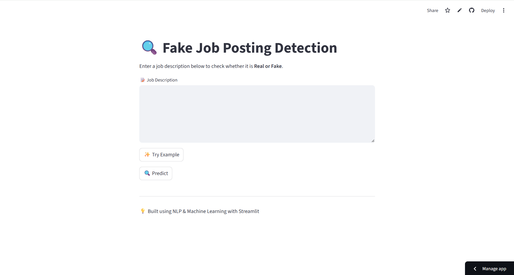
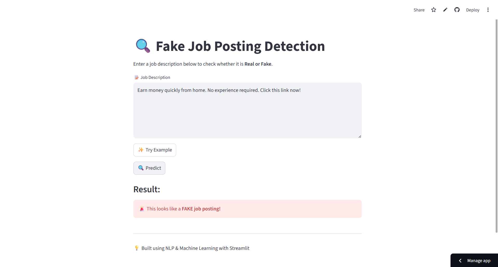
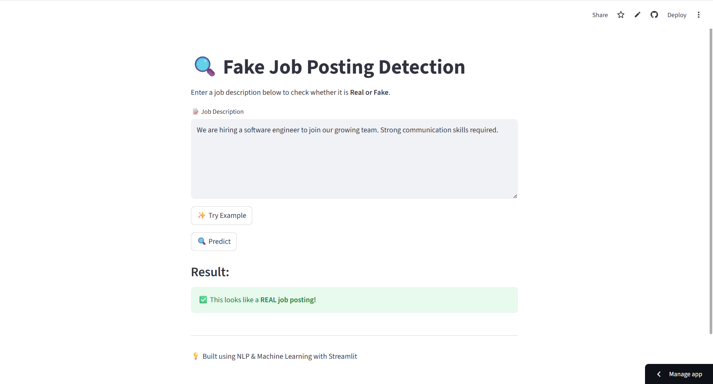

&nbsp;&nbsp;&nbsp;&nbsp;&nbsp;&nbsp;&nbsp;&nbsp;&nbsp;&nbsp;
&nbsp;&nbsp;&nbsp;&nbsp;&nbsp;&nbsp;&nbsp;&nbsp;&nbsp;&nbsp;
&nbsp;&nbsp;&nbsp;&nbsp;&nbsp;&nbsp;&nbsp;&nbsp;&nbsp;&nbsp;
)

# 🔍 Fake Job Posting Detection using NLP

A data science project that detects fraudulent job postings using Natural Language Processing (NLP) and Machine Learning techniques. The model analyzes job descriptions and classifies them as **Real or Fake**.

## 🌐 Live Demo
[🚀 Visit App↗](https://fake-job-detector-bushra.streamlit.app/)

## 🚀 Features
- Detects fake job postings from user input  
- Uses TF-IDF vectorization for text processing  
- Logistic Regression model for classification  
- Interactive web app built using Streamlit  

## 📊 Model Performance
- Accuracy: ~96% (before handling imbalance)  
- Improved to ~99% after applying oversampling  
- Strong precision and recall for fraud detection  

## 🛠️ Tech Stack
- Python  
- Pandas, NumPy  
- Scikit-learn  
- NLP (TF-IDF Vectorization)  
- Streamlit  

## 📄 License

This project is licensed under the MIT License 
see the [LICENSE↗](LICENSE) file for details.

## 📸 App Preview

### 🏠 Home Screen

### 🚨 Fake Job Detection

### ✅ Real Job Detection

## 🧠 What I Learned
- Text preprocessing using NLP techniques  
- Feature extraction using TF-IDF  
- Handling imbalanced datasets using oversampling  
- Building and evaluating machine learning models  
- Deploying ML models as web applications using Streamlit  

## 🧪 Testing
The application was tested using multiple real and synthetic job descriptions, including edge cases like empty input and long text, to ensure robustness and reliability. 

## ▶️ How to Run Locally

pip install -r requirements.txt
streamlit run app.py

## 🤝 Contribution

Contributions are welcome! If you’d like to improve this project 
Feel free to explore, use, and improve the project 🚀

## Author

Bushra Shaikh